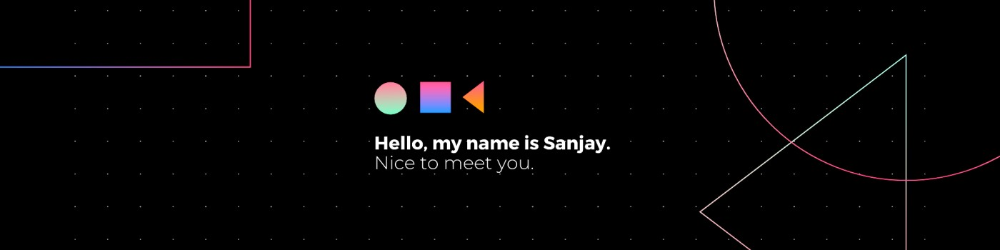

<!--Banner-->


<div align="center">

#  Hello, I'm **Sanjay Kumar**! 


<br/>

<!-- Professional Intro Section -->
<table>
<tr>
<td width="60%" align="left">

### 🚀 **About Me**
**Passionate Full-Stack Developer** specializing in creating seamless digital experiences with expertise in **UI/UX Design** and **Machine Learning**. Currently building innovative solutions that bridge technology and creativity.

**🎯 Currently Working On:**  
E-commerce digital store leveraging social media for sales generation

**🌱 Learning & Growing:**  
Node.js • Web Security • Flutter App Development

**🤝 Open to Collaborate:**  
App Design & Development • AI-Powered Web Solutions

**📊 Social Impact:**  
20k+ followers with 90% engagement rate

</td>
<td width="40%" align="center">

### 🔗 **Quick Access**

*Explore my work, connect with me, and discover my journey through these curated links*

<a href="https://designwithsanjay.site/" target="_blank">

</a>

<a href="https://storage2.me-qr.com/pdf/02e52d21-3182-40b6-be68-a77f796cbd6b.pdf" target="_blank">

</a>

<a href="https://www.behance.net/attellisanjay/" target="_blank">

</a>

<a href="https://github.com/sanjayattelli29" target="_blank">

</a>

<a href="mailto:attellisanjay29@gmail.com" target="_blank">

</a>

<a href="https://github.com/sanjayattelli29" target="_blank">

</a>

</td>
</tr>
</table>

</div>

---

## 🚀 Tech Stack & Technologies

<div align="center">

**Programming Languages**
<p>
  
  
  
  
  
  
  
  
</p>

**Frontend Technologies**
<p>
  
  
  
  
  
  
</p>

**Backend & Frameworks**
<p>
  
  
  
  
  
</p>

**Cloud & Database**
<p>
  
  
  
  
  
  
</p>

**AI & Machine Learning**
<p>
  
  
  
  
  
  
</p>

**Design & Development Tools**
<p>
  
  
  
  
  
  
  
</p>

</div>

---

## 🌟 My SaaS Product

<div align="center">

### 🚀 **Smart Data Analyser** - AI-Powered Analytics Platform


**Transform your data into actionable insights with our revolutionary AI-powered platform**

📊 **Analyze** • 📈 **Visualize** • 🔮 **Predict** with exceptional accuracy and speed

*Powered by AI Agents & Deep Learning - Exclusively designed for students willing to learn data analysis*

<br/>

### 🎥 **Project Demo**

<div align="center">
<iframe width="864" height="486" src="https://www.youtube.com/embed/CkeMWDcaAVs" title="Smart Data Analyser powered by AI Agents &amp; Deep Learning." frameborder="0" allow="accelerometer; autoplay; clipboard-write; encrypted-media; gyroscope; picture-in-picture; web-share" referrerpolicy="strict-origin-when-cross-origin" allowfullscreen></iframe>
</div>

<br/>

### **✨ Key Features & Capabilities:**

<div align="center">

<table>
<tr>
<td width="50%">

🤖 **AI Agents** for automated data processing and intelligent insights generation

🧠 **Deep Learning** models for advanced pattern recognition and predictive analytics

📊 **Interactive Visualizations** with real-time updates and customizable dashboards

🎯 **Student-Focused** learning modules with step-by-step tutorials and guided workflows

</td>
<td width="50%">

⚡ **Lightning Fast** analysis and insights generation with cloud-optimized performance

🔒 **Secure & Scalable** architecture built on modern cloud infrastructure

📚 **Educational Resources** including documentation, tutorials, and best practices

💡 **Community-Driven** development with continuous feedback and feature improvements

</td>
</tr>
</table>

</div>

<br/>

<a href="https://dataviz-ai.netlify.app/" target="_blank">

</a>

<a href="https://dataviz-ai.netlify.app/" target="_blank">

</a>

</div>

---

## 💼 Professional Experience

### 🎨 **UI/UX Designer** | *Aspireup* `Remote`
**📅 August 2024 - October 2024**
- 🎯 **Ergonomic Interface**: Designed user-centric, visually compelling interfaces for seamless navigation
- 📱 **Adaptive Responsiveness**: Developed fully responsive layouts for consistent cross-device experiences  
- ⚡ **Interactive Dynamics**: Added real-time updates with advanced front-end technologies
- 🚀 **Performance Focus**: Optimized design systems for enhanced user experience

### 🌐 **Web Designer-Developer** | *Jacinth Paul Business Technologies Pvt Ltd* `On-Site`
**📅 April 2024 - June 2024**
- 🎓 **Personalized Learning Platform**: Built customized learning pathways for individual student needs
- 🎓 **Interactive Tutorials**: Created engaging tutorials for complex subject understanding
- 📊 **Measurable Impact**: **500+ students** enrolled with **4.65⭐ average rating**
- 🚀 **Innovation**: Implemented modern web technologies for enhanced learning experiences

### 👨‍💻 **Full-Stack Developer & Entrepreneur**
**📅 Current Role - Building Digital Solutions**
- 🛒 **E-commerce Platform**: Developing revenue-generating digital store with social media integration
- 📊 **SaaS Product**: Built Smart Data Analyser - AI-powered analytics platform for students
- 🎨 **Design Systems**: Creating scalable UI/UX components and design frameworks
- 📈 **Social Media Growth**: Growing engaged community of 20k+ followers with 90% engagement rate
- 🤖 **AI Integration**: Implementing machine learning solutions in web applications

---

## 🚀 Featured Projects

<table>
<tr>
<td width="50%">

### 🛒 **E-commerce Digital Store**
**Revenue-focused platform with social media integration**

🌐 **Live**: [editwithsanjay.in](http://editwithsanjay.in/)

**✨ Key Features:**
- 💰 Strategic social media marketing (20k+ followers)
- 🎯 Premium digital products for creators
- ⚡ Instant access to digital assets
- 📊 Revenue generation through community engagement

**🛠️ Tech:** React.js, TypeScript, Node.js, Tailwind CSS, AWS Lambda, Figma

</td>
<td width="50%">

### 📝 **NotesGalaxy - Ultimate Productivity App**
**All-in-one solution for notes, tasks, and file management**

**✨ Key Features:**
- ☁️ Secure AWS cloud storage integration
- 🎨 Intuitive drag-and-drop UI/UX
- 🤖 AI-powered smart suggestions for task prioritization
- 📱 Cross-device accessibility and synchronization

**🛠️ Tech:** Python, Flask, AWS, TypeScript, React.js, Supabase

</td>
</tr>
<tr>
<td width="50%">

### 🌾 **Agri Assist - Smart Farming Companion**
**ML-powered agricultural assistance platform**

**✨ Key Features:**
- 🌱 Crop predictions based on weather/soil conditions
- 🔍 Disease identification via image recognition
- 📊 **96% accuracy** with ML models (Research pending publication)
- 💊 Pesticide and fertilizer recommendations

**🛠️ Tech:** Random Forest, KNN, LightGBM, AWS, TypeScript, Node.js

</td>
<td width="50%">

### 📊 **Web-Insights - Real-Time Analytics**
**Transform website data into actionable insights**

**✨ Key Features:**
- 📈 Real-time traffic analytics dashboard
- 🌍 IP/Country/Device-based monitoring
- 💳 Secure payment integrations
- 👥 Advanced user tracking and ad customer analytics

**🛠️ Tech:** React.js, TypeScript, Node.js, Tailwind CSS, AWS Lambda

</td>
</tr>
<tr>
<td width="50%">

### 📅 **Content-Flow - Smart Workflow Management**
**Precision scheduling and task management platform**

**✨ Key Features:**
- 📋 Intuitive content workflow solution
- 📊 Daily, weekly, and monthly task management
- 📈 Insightful analytics and progress tracking
- 🔐 Secure login functionality

**🛠️ Tech:** React.js, TypeScript, Node.js, Tailwind CSS, Framer Motion

</td>
<td width="50%">

### 🌍 **Air Quality Monitoring Dashboard**
**Real-time air quality monitoring with ML predictions**

**✨ Key Features:**
- 🏠 **Live AQI data** for any location with Google AQI API
- 🤖 **ML algorithms** for pollution trend analysis (**96% accuracy**)
- 📊 **Advanced Analytics** with Random Forest, KNN, LightGBM, MLP models
- 📝 **Research project** (pending publication)

**🛠️ Tech:** Machine Learning, Web Development, AWS, TypeScript, Supabase

</td>
</tr>
</table>

---

## 🎯 Skills & Core Competencies

<div align="center">

### 🔧 **Technical Expertise**
| Category | Skills |
|----------|--------|
| **🔧 Data Structures** | Arrays, Linked Lists, Trees, Graphs, Hash Tables, Stacks, Queues |
| **⚡ Algorithms** | Sorting, Searching, Dynamic Programming, Greedy, Graph Algorithms |
| **🎨 Frontend** | React.js, Next.js, Vue.js, TypeScript, Tailwind CSS, Bootstrap, Framer Motion |
| **⚙️ Backend** | Node.js, Python, Flask, FastAPI, Express.js, RESTful APIs |
| **☁️ Cloud & Database** | AWS, Lambda, Supabase, MongoDB, MySQL, Firebase |
| **🤖 ML/AI** | Scikit-learn, TensorFlow, PyTorch, Pandas, NumPy, Deep Learning |
| **🛠️ Development Tools** | VS Code, Git, GitHub, Docker, Anaconda, Jupyter Notebook |
| **🎨 Design Tools** | Figma, Adobe XD, Prototyping, UI/UX Design, Design Systems |

### 🧠 **Soft Skills & Core Competencies**
```
🗣️ Communication  •  🤝 Team Collaboration  •  🧮 Analytical Thinking
⏰ Time Management  •  💡 Problem Solving  •  👥 Leadership
🔍 User Research  •  🎯 Strategic Planning  •  📊 Data Analysis
```

### 📊 **Specialized Areas**
<table>
<tr>
<td width="33%" align="center">

**🎨 Design Excellence**
- UI/UX Design
- User Research & Testing
- Prototyping & Wireframing
- Design Systems
- Brand Identity
- Responsive Design

</td>
<td width="33%" align="center">

**💻 Development Mastery**
- Full-Stack Development
- API Design & Integration
- Database Architecture
- Performance Optimization
- Code Quality & Testing
- Agile Development

</td>
<td width="33%" align="center">

**🤖 AI & Data Science**
- Machine Learning Models
- Data Analysis & Visualization
- Algorithm Optimization
- Deep Learning
- Statistical Analysis
- Research & Publication

</td>
</tr>
</table>

</div>

---

## 🏆 Certifications & Learning Journey

<details>
<summary><b>🏆 Click to view all certifications & achievements</b></summary>

| 📅 Date | 🏢 Provider | 📚 Course | 🎯 Status |
|----------|------------|-----------|-----------|
| **Nov 2024** | Smart Interviews | Data Structures and Algorithms | ✅ Completed |
| **2025** | Udemy | AWS Essentials – Complete Beginner's Guide | ✅ Completed |
| **2025** | Udemy | ReactJS – The Complete Course | ✅ Completed |
| **Mar 2024** | Guvi & Google | Python Programming Certification | ✅ Completed |
| **2025** | Udemy | Data Visualization in Tableau and Python | ✅ Completed |
| **May 2024** | Google | High-Fidelity Designs and Prototypes in Figma | ✅ Completed |
| **2025** | Udemy | Machine Learning with Python A to Z | ✅ Completed |
| **2025** | Udemy | Mastering Gemini AI – Google's Language Model | ✅ Completed |

</details>

### 🥇 **Notable Achievements**

🏆 **Winner - Webathon 3.0** (ACM VNRVJIET, April 2025)
   - Built E-commerce Optimization Platform with AWS Lambda
   - Integrated real-time analytics & social-driven payments

🥉 **Fourth Runner's Up** - Webathon Developers Circle Hackathon (March 2024)

📱 **Social Media Impact:**
- 📸 **15k+ Instagram followers** for design content
- 💼 **3k+ LinkedIn connections** sharing design insights  
- 🎥 **1k+ YouTube subscribers** (July 2024)
- 💰 **Revenue generation** through social media marketing integration

---

## 🤝 Volunteer Experience & Community Impact

### 🌟 **Making a Difference Through Technology**

As a passionate advocate for inclusive technology education, I've dedicated myself to building bridges between students and the tech industry. Through my leadership roles at **Google Developer Student Clubs** and **SMC Group**, I've fostered collaborative environments where learning thrives and innovation flourishes.

**🎯 My Mission:** Creating accessible pathways for aspiring developers and designers to enter the tech ecosystem, regardless of their background or experience level.

**📈 Impact Achieved:**
- **500+ students** directly mentored in web development and modern technologies
- **20+ workshops** organized covering full-stack development, UI/UX design, and emerging technologies
- **15k+ social media followers** inspired through educational design content and coding tutorials
- **3 major hackathons** led with focus on practical skill building and real-world problem solving
- **4.65⭐ average rating** from students across all educational initiatives

**💡 Current Initiatives:**
- Developing free coding bootcamps for underserved communities
- Creating comprehensive learning resources and interactive video tutorials
- Building mentor-mentee networks for continuous professional growth
- Promoting diversity and inclusion in tech spaces through community outreach

**🏆 Leadership Roles:**

<div align="center">

| Role | Organization | Duration | Key Achievements |
|------|-------------|----------|------------------|
| **👨‍💻 Coder** | Google Developer Student Clubs VNR-VJIET | Jan 2024 | Led technical sessions, organized hackathons |
| **📱 Student Coordinator** | SMC Group VNR-VJIET | Jan 2024 | Enhanced digital presence, strategic content planning |
| **🎓 Community Educator** | Tech Education Initiative | 2023 - Present | Free workshops, mentoring programs |

</div>


---

## 🎓 Education & Academic Excellence

<table>
<tr>
<td width="50%">

### 🏛️ **VNR VJIET Engineering College**
**📅 January 2025 - Present**

🎓 **Bachelor of Technology** - Information Technology  
📊 **GPA**: 8.50/10

**📚 Core Courses:**
- Data Structures & Algorithms
- Software Engineering  
- Database Management Systems
- Object-Oriented Programming

**🔬 Open Electives:**
- Cloud Computing
- Agile Software Development
- Cybersecurity

</td>
<td width="50%">

### 🏫 **Sri Chaitanya Institutions**

**📅 Higher Secondary (May 2022)**  
📖 **Stream:** MPC (Mathematics, Physics, Chemistry)  
📊 **GPA**: 93.1%

**📅 Secondary School (May 2020)**  
📖 **Secondary School Education**  
📊 **GPA**: 100% 🏅

**🏅 Perfect Score Achievement**
- Exceptional academic performance
- Strong foundation in STEM subjects
- Consistent academic excellence

</td>
</tr>
</table>

---

## 📊 GitHub Analytics & Development Insights

<div align="center">

### 📈 **Coding Journey & Statistics**

<table>
<tr>
<td width="50%">


</td>
<td width="50%">


</td>
</tr>
</table>


<br/>


<br/>

### 🏆 **Development Highlights**

<table>
<tr>
<td width="25%" align="center">

**📈 Total Commits**
### 309+
*Dec 2023 - Present*

</td>
<td width="25%" align="center">

**🔥 Current Streak**
### 3 Days
*Active Coding*

</td>
<td width="25%" align="center">

**⭐ Public Repos**
### 25+
*Open Source*

</td>
<td width="25%" align="center">

**👥 Followers**
### 50+
*Growing Community*

</td>
</tr>
</table>

### 🎯 **Most Used Technologies**

<table>
<tr>
<td align="center">🥇 **Jupyter Notebook** 51.90%</td>
<td align="center">🥈 **TypeScript** 34.09%</td>
<td align="center">🥉 **JavaScript** 6.38%</td>
</tr>
<tr>
<td align="center">🏅 **Python** 5.03%</td>
<td align="center">🏅 **CSS** 1.29%</td>
<td align="center">🏅 **HTML** 1.15%</td>
</tr>
</table>

</div>

---

---

<!--Dynamic Quote card updates everyday at 12 PM--> 
<h2 align="center">🌟 Tʜᴏᴜɢʜᴛ ᴏғ ᴛʜᴇ Dᴀʏ 🌟</h2>

<!--STARTS_HERE_QUOTE_CARD-->
<p align="center">
    
</p>
<!--ENDS_HERE_QUOTE_CARD-->

---

## 🌐 Let's Connect & Build Next-Level Projects Together!

<div align="center">

<table>
<tr>
<td width="30%" align="center">

### 🧑‍💻 **Meet Sanjay**


**🚀 Full-Stack Developer**  
**🎨 UI/UX Designer**  
**🤖 AI Enthusiast**

*Building the future through innovative technology solutions*

</td>
<td width="70%" align="center">

### 💬 **Ready to Collaborate?**

**Let's create something amazing together! I'm always excited to work on innovative projects, share knowledge, and build meaningful connections in the tech community.**

*🎯 Open for freelance projects • 💡 Love discussing new ideas • 🤝 Always ready to mentor*

<br/>

**📬 Get In Touch:**

<a href="mailto:attellisanjay29@gmail.com" target="_blank">

</a>
<a href="https://linkedin.com/in/attelli-sanjay-kumar" target="_blank">

</a>
<a href="https://github.com/sanjayattelli29" target="_blank">

</a>

<a href="https://www.instagram.com/editwithsanjay/" target="_blank">

</a>
<a href="https://twitter.com/SanjayAttelli" target="_blank">

</a>
<a href="https://www.behance.net/attellisanjay/" target="_blank">

</a>

<a href="https://designwithsanjay.site/" target="_blank">

</a>

</td>
</tr>
</table>

<br/>

### 🎯 **What I Bring to the Table**

<table>
<tr>
<td width="25%" align="center">

**🔧 Technical Skills**
Full-Stack Development, AI/ML Integration, Cloud Solutions

</td>
<td width="25%" align="center">

**🎨 Design Expertise**
UI/UX Design, Prototyping, User Research

</td>
<td width="25%" align="center">

**💻 Business Acumen**
SaaS Development, Social Media Strategy, Revenue Generation

</td>
<td width="25%" align="center">

**🤝 Community Impact**
Mentoring, Teaching, Open Source Contributions

</td>
</tr>
</table>

### 💼 **Looking For Opportunities In:**

```
🚀 Innovative Web Development Projects  •  🤖 AI/ML Integration Solutions
🎨 UI/UX Design Consultations  •  📱 Social Media Strategy & Digital Marketing
🤖 SaaS Product Development  •  🎓 Educational Technology Initiatives
```

### 📞 **Quick Contact**
```
📧 attellisanjay29@gmail.com  |  📱 +91 8919200290  |  🌐 designwithsanjay.site
```

<br/>

### ☕ **Support My Work**

<a href="https://buymeacoffee.com/attellisanjay" target="_blank">

</a>

*Your support helps me continue creating free resources and contributing to the open-source community!*

</div>

---

<div align="center">
  
  
  **✨ "Building the future, one line of code at a time" ✨**
  
  <br/><br/>
  
  **🌟 Thanks for visiting my profile! Star ⭐ my repositories if you find them interesting! 🌟**
</div>

<!--Footer--> 
<p align="center">
  
</p>
